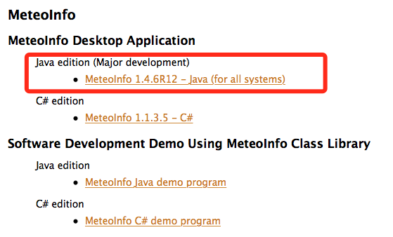
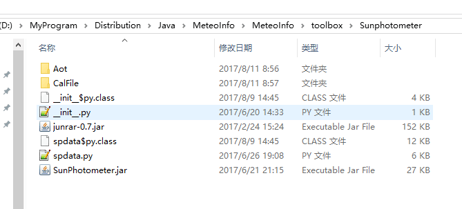

# SunPhotometer

* Source code : SunPhotometer.rar
* Testing script
  * cal_aod.py
  * check_k7.py
  * K7_1.py
  * download_aod.py
  * merge_1.py
  * unrar_1.py
* Testing Data
  * test.rar

## SunPhotometer.spdata

MeteoInfo <http://www.meteothinker.com>

